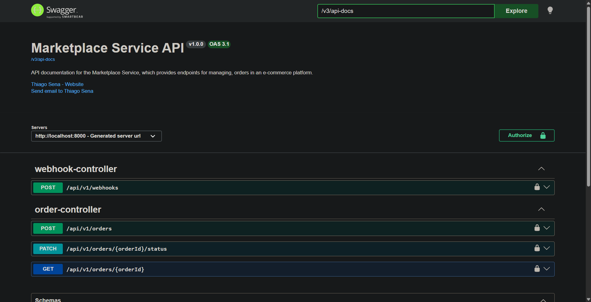
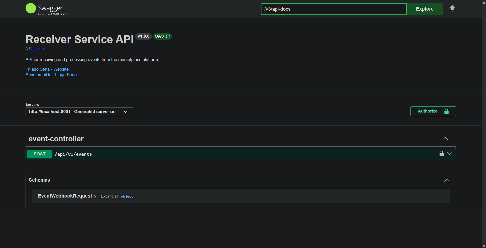
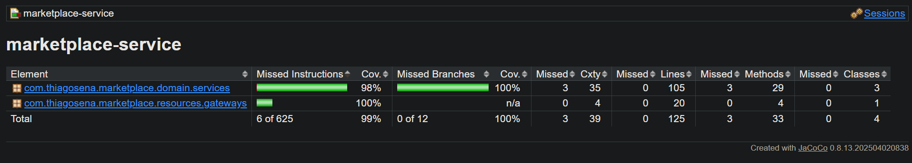
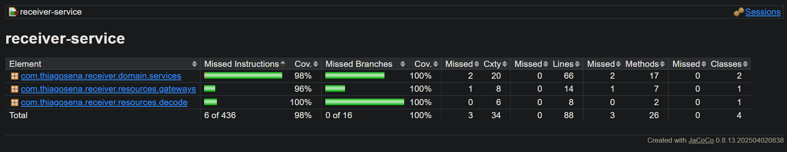
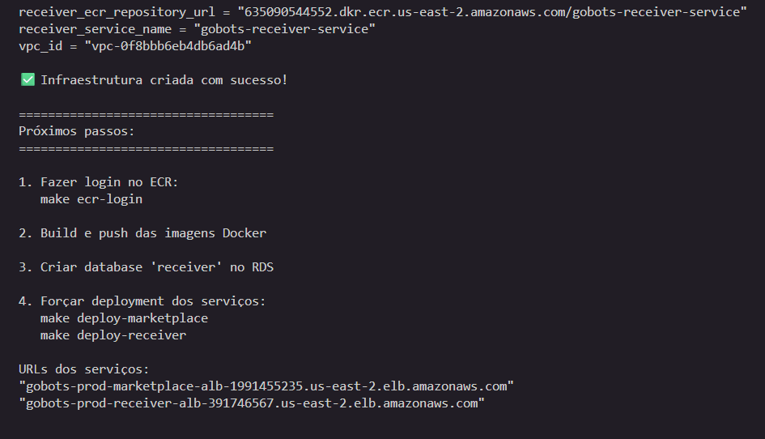
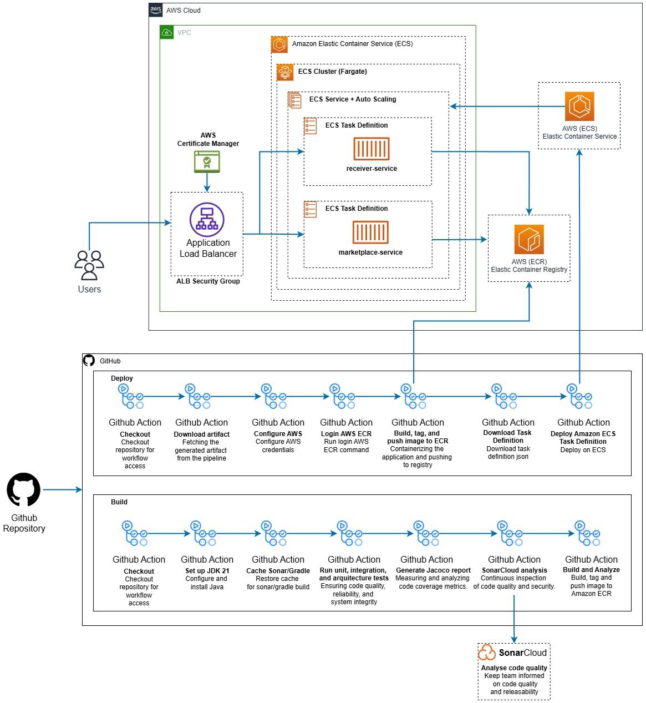

<div align="center">

[](https://github.com/thiagosena/marketplace-webhook-system/actions/workflows/marketplace-service.yml)
[](https://github.com/thiagosena/marketplace-webhook-system/actions/workflows/receiver-service.yml)

[](https://sonarcloud.io/dashboard?id=thiagosena_marketplace-webhook-system)
[](https://sonarcloud.io/dashboard?id=thiagosena_marketplace-webhook-system)
[](https://sonarcloud.io/dashboard?id=thiagosena_marketplace-webhook-system)
[](https://sonarcloud.io/dashboard?id=thiagosena_marketplace-webhook-system)
</div>

# 🛒 Marketplace & Receiver Services

Sistema distribuído de processamento de pedidos que demonstra comunicação assíncrona entre microserviços através de webhooks. O projeto implementa um fluxo completo onde o marketplace notifica sistemas externos sobre eventos de pedidos, permitindo que múltiplos consumidores processem e enriqueçam essas informações de forma independente.


## 🔍 Visão Geral

Este projeto simula um cenário real de e-commerce onde:

1. **[Marketplace Service](marketplace-service/README.md)** recebe e processa pedidos de diferentes lojas
2. Ao criar um pedido, o marketplace dispara webhooks para sistemas registrados
3. **[Receiver Service](receiver-service/README.md)** atua como consumidor, recebendo notificações, enriquecendo dados e persistindo informações processadas
4. Cada serviço mantém seu próprio banco de dados, seguindo o padrão de database-per-service

### 🔄 Fluxo End-to-End

```
Marketplace Service → Webhook → Receiver Service → Banco de Dados
  (cria pedido)      (notifica)    (enriquece)      (persiste)
```

## 🏗️ Arquitetura

### 🚀 Serviços

- **Marketplace Service** (porta 8000)
  - Gerenciamento de pedidos e lojas
  - Sistema de registro e disparo de webhooks
  - API REST para criação de pedidos
  - Autenticação via token compartilhado

- **Receiver Service** (porta 8001)
  - Recepção de eventos via webhook
  - Enriquecimento de dados dos pedidos
  - Persistência de eventos processados
  - Validação de autenticidade dos webhooks

- **PostgreSQL** (porta 5434)
  - Banco de dados compartilhado
  - Schemas isolados por serviço (marketplace_service, receiver_service)
  - Migrations gerenciadas via Flyway

### 🛠️ Stack Tecnológica

- **Backend**: Kotlin + Spring Boot
- **Banco de Dados**: PostgreSQL 16
- **Containerização**: Docker + Docker Compose
- **Infraestrutura**: Terraform (AWS ECS, RDS, VPC)
- **Migrations**: Flyway
- **HTTP Client**: OpenFeign

## 📋 Pré-requisitos

- Docker
- Docker Compose

## 🚀 Como Executar

### 1️⃣ Subir a aplicação

```bash
cd docker
docker-compose up -d
```

Aguarde alguns segundos para os serviços iniciarem completamente. Você pode acompanhar os logs:

```bash
docker-compose logs -f
```

### 2️⃣ Validar o fluxo end-to-end

#### ✅ Passo 1: Registrar o webhook

Primeiro, registre o receiver-service como destino dos webhooks do marketplace:

```bash
curl -X POST http://localhost:8000/api/v1/webhooks \
  -H "Content-Type: application/json" \
  -H "Authorization: marketplace-service-secret" \
  -d '{
    "store_ids": ["store-1"],
    "callback_url": "http://receiver-service:8001/api/v1/events",
    "token": "receiver-service-secret"
  }'
```

#### ✅ Passo 2: Criar um pedido

Crie um pedido no marketplace. Isso automaticamente dispara o webhook para o receiver:

```bash
curl -X POST http://localhost:8000/api/v1/orders \
  -H "Content-Type: application/json" \
  -H "Authorization: marketplace-service-secret" \
  -d '{
    "store_id": "store-1",
    "items": [
      {
        "product_name": "Placa de video RTX 5090",
        "quantity": 1,
        "unit_price": 8980,
        "discount": 100,
        "tax": 10
      }
    ]
  }'
```

#### ✅ Passo 3: Verificar o resultado

O fluxo completo acontece automaticamente:
1. Marketplace cria o pedido
2. Marketplace dispara webhook para o receiver
3. Receiver recebe o evento, enriquece os dados e salva

Você pode verificar os logs para confirmar:

```bash
docker-compose logs marketplace-service | grep -i webhook
docker-compose logs receiver-service | grep -i event
```

#### ✅ Passo 4: Transitar entre os status do pedido

Altere o status de um pedido no marketplace. Isso automaticamente dispara o webhook para o receiver:

```bash
curl -X PATCH http://localhost:8000/api/v1/orders/cf062c2f-0a31-472c-a34f-356f9461014f/status \
  -H "Content-Type: application/json" \
  -H "Authorization: marketplace-service-secret" \
  -d '{
    "status": "PAID"
  }'
```

## 🛑 Parar a aplicação

```bash
cd docker
docker-compose down
```

Para remover também os volumes (dados do banco):

```bash
docker-compose down -v
```

## 📁 Estrutura do Projeto

```
.
├── marketplace-service/    # Serviço de marketplace (Kotlin/Spring Boot)
├── receiver-service/       # Serviço receptor de eventos (Kotlin/Spring Boot)
├── docker/                 # Configuração Docker Compose
└── infra/                  # Infraestrutura AWS (Terraform)
```
## 🧩 Documentação das APIs com Swagger UI

- [**Marketplace Service**](http://localhost:8000/swagger-ui/index.html): Documentação da API do marketplace-service
<p align="center">
  </img>
  <br/>
  <span>Figura 1: Documentação da API com Swagger-UI do marketplace-service</span>
</p>

- [**Receiver Service**](http://localhost:8001/swagger-ui/index.html): Documentação da API do receiver-service
<p align="center">
  </img>
  <br/>
  <span>Figura 2: Documentação da API com Swagger-UI do receiver-service</span>
</p>

## 🧪 Lint e Cobertura de Testes
- [**SonarLint**](https://www.sonarlint.org/intellij): Integrado a IDE Intellij
- [**JaCoCo**](https://github.com/jacoco/jacoco): Cobertura de testes

<p align="center">
  </img>
  <br/>
  <span>Figura 3: Tela inicial do JaCoCo com a cobertura de testes do marketplace-service</span>
</p>
<p align="center">
  </img>
  <br/>
  <span>Figura 4: Tela inicial do JaCoCo com a cobertura de testes do receiver-service</span>
</p>

- [**SonarCloud**](https://sonarcloud.io/project/overview?id=thiagosena_marketplace-webhook-system): Melhorar a qualidade e segurança do código.

## ☁️ Terraform para provisionamento da infraestrutura na AWS
O Terraform é uma ferramenta de Infraestrutura como Código (IaC) criada pela HashiCorp que permite criar, modificar e 
versionar infraestrutura de forma automatizada e declarativa.

Em vez de configurar servidores, redes e serviços manualmente no console da nuvem, você descreve toda a infraestrutura 
em arquivos de código (usando a linguagem HCL – HashiCorp Configuration Language). O Terraform então interpreta esse 
código e provisiona os recursos automaticamente em provedores como Amazon Web Services, Microsoft Azure, 
Google Cloud Platform, entre outros.

### 🚀 Principais vantagens:
- Automação e redução de erros manuais
- Versionamento da infraestrutura (via Git, por exemplo)
- Reprodutibilidade de ambientes (dev, staging, produção)
- Multicloud e multi-provider
- Infraestrutura padronizada e escalável

<p align="center">
  </img>
  <br/>
  <span>Figura 5: Terraform sendo executado</span>
</p>

## 🔄 CI/CD
O processo de execução dos testes estão sendo realizados no github action com o SonarCloud. O code deploy foi 
implementado utilizando a infraestrutura da AWS. Para isso, se a build, junto com os testes e o SonarCloud forem 
executados com sucesso, o github action cria as imagens e salva no ECR fazer a execução do deploy no ECS.

<p align="center">
  </img>
  <br/>
  <span>Figura 6: Arquitetura da infraestrutura para AWS ECS com AWS e Github Actions</span>
</p>

## 🔧 Troubleshooting

### ⚠️ Serviços não iniciam

Verifique se as portas 8000, 8001 e 5434 estão disponíveis:

```bash
netstat -an | findstr "8000 8001 5434"
```

### 💚 Verificar saúde dos serviços

```bash
curl http://localhost:8000/actuator/health
curl http://localhost:8001/actuator/health
```

### 📋 Acessar logs de um serviço específico

```bash
docker-compose logs -f marketplace-service
docker-compose logs -f receiver-service
docker-compose logs -f postgres
```